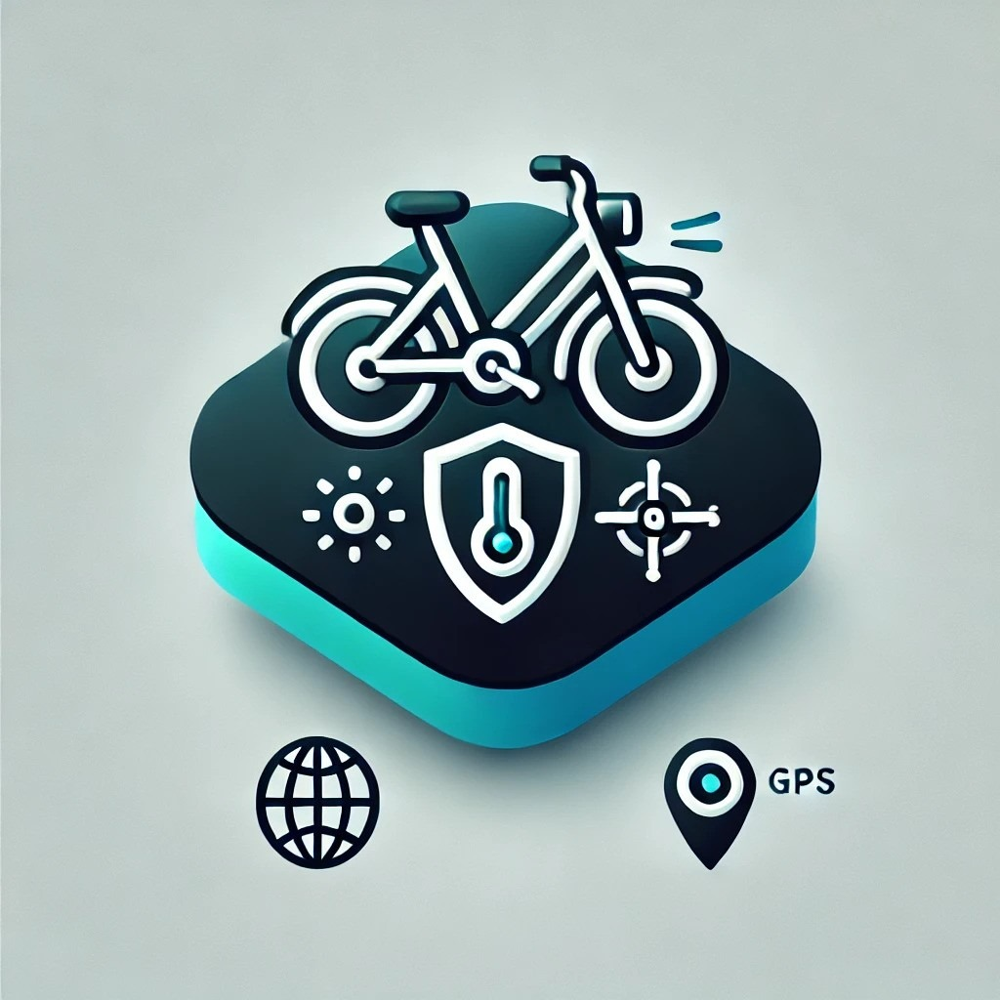

# 🚴‍♂️ BikeSafe

A comprehensive bike security and monitoring system that combines IoT sensors, Bluetooth connectivity, and mobile technology to keep your bike safe and monitored.



## 📋 Table of Contents

- [Overview](#overview)
- [Features](#features)
- [Architecture](#architecture)
- [Prerequisites](#prerequisites)
- [Installation](#installation)
- [Configuration](#configuration)
- [Usage](#usage)
- [API Documentation](#api-documentation)
- [Development](#development)
- [Contributing](#contributing)
- [License](#license)

## 🌟 Overview

BikeSafe is an intelligent bike security system that provides real-time monitoring, theft alerts, and environmental tracking for your bicycle. The system consists of:

- **Flutter Mobile App**: Cross-platform mobile application for iOS and Android
- **Node.js Backend**: RESTful API server with MongoDB database
- **IoT Integration**: ESP32-based sensors for real-time data collection
- **Bluetooth Connectivity**: Seamless communication between sensors and mobile device

## ✨ Features

### 🔐 Security & Authentication
- **User Registration & Login**: Secure account creation with email verification
- **Google OAuth Integration**: Quick sign-in with Google accounts
- **Password Reset**: Secure password recovery via email
- **JWT Token Authentication**: Secure API access

### 📱 Mobile App Features
- **Real-time Sensor Monitoring**: Live data from temperature, humidity, GPS, and motion sensors
- **Bluetooth Device Management**: Connect and manage ESP32/Arduino devices
- **Interactive Maps**: Google Maps integration for location tracking
- **Push Notifications**: Real-time alerts for security events
- **Battery Monitoring**: Track bike battery status and history
- **Dark/Light Theme**: Customizable app appearance
- **Admin Panel**: Administrative features for user management

### 🌐 Backend Features
- **RESTful API**: Comprehensive API for all app functions
- **Database Management**: MongoDB integration for data persistence
- **Email Services**: SendGrid integration for notifications
- **Firebase Integration**: Push notification support
- **Location Services**: GPS tracking and geofencing
- **Sensor Data Processing**: Real-time IoT data handling

### 🔧 IoT & Hardware
- **ESP32 Integration**: Support for ESP32-based sensor modules
- **Bluetooth Serial Communication**: Reliable data transmission
- **Multiple Sensor Support**: Temperature, humidity, GPS, motion detection
- **Real-time Data Streaming**: Live sensor data updates

## 🏗️ Architecture

```
┌─────────────────┐    ┌─────────────────┐    ┌─────────────────┐
│   Flutter App   │◄──►│   Node.js API   │◄──►│    MongoDB      │
│                 │    │                 │    │    Database     │
└─────────────────┘    └─────────────────┘    └─────────────────┘
          │                       │
          │                       │
          ▼                       ▼
┌─────────────────┐    ┌─────────────────┐
│ ESP32 Sensors   │    │   Firebase FCM  │
│ (via Bluetooth) │    │  (Push Notifications)│
└─────────────────┘    └─────────────────┘
```

## 📋 Prerequisites

### For Mobile App Development
- **Flutter SDK**: ^3.6.0
- **Dart**: Latest stable version
- **Android Studio**: For Android development
- **Xcode**: For iOS development (macOS only)

### For Backend Development
- **Node.js**: v16.0 or higher
- **MongoDB**: v4.4 or higher
- **npm**: v8.0 or higher

### External Services
- **Google Cloud Console**: For OAuth and Maps API
- **Firebase**: For push notifications
- **SendGrid**: For email services

## 🚀 Installation

### 1. Clone the Repository

```bash
git clone https://github.com/liavjulio/bikesafe.git
cd bikesafe
```

### 2. Backend Setup

```bash
cd bikesafe-backend
npm install

# Copy and configure environment variables
cp .env.example .env
# Edit .env with your configuration

# Start the server
npm start
```

### 3. Mobile App Setup

```bash
cd bikesafe_app

# Install Flutter dependencies
flutter pub get

# Run the app
flutter run
```

## ⚙️ Configuration

### Backend Environment Variables (.env)

```env
# Database
MONGODB_URI=mongodb://localhost:27017/bikesafe
JWT_SECRET=your-jwt-secret-key

# Google OAuth
GOOGLE_CLIENT_ID=your-google-client-id
GOOGLE_CLIENT_SECRET=your-google-client-secret

# SendGrid Email
SENDGRID_API_KEY=your-sendgrid-api-key
FROM_EMAIL=noreply@bikesafe.com

# Firebase
FIREBASE_ADMIN_SDK_PATH=./bike-safe-24118-e2932191e023.json

# Server
PORT=3000
NODE_ENV=development
```

### Mobile App Configuration

1. **Google Services Setup**:
   - Place `google-services.json` in `android/app/`
   - Configure `GoogleService-Info.plist` for iOS

2. **API Configuration**:
   - Update `lib/utils/constants.dart` with your backend URL

3. **Maps API**:
   - Add your Google Maps API key to `android/app/src/main/AndroidManifest.xml`

## 📱 Usage

### Getting Started

1. **Register an Account**:
   - Open the app and tap "Register"
   - Enter your email and create a password
   - Or use "Login with Google" for quick access

2. **Connect Your Bike Sensor**:
   - Ensure your ESP32 device is paired via Bluetooth
   - Go to the main screen and select your device
   - Tap "Connect" to establish communication

3. **Monitor Your Bike**:
   - View real-time sensor data on the dashboard
   - Check battery levels and environmental conditions
   - Receive alerts for unusual activity

### Key Features

#### 🔍 Real-time Monitoring
- **Temperature & Humidity**: Environmental conditions
- **GPS Tracking**: Live location updates
- **Battery Status**: Power level monitoring
- **Motion Detection**: Security alerts

#### 🗺️ Location Services
- **Interactive Maps**: Visual location tracking
- **Geofencing**: Custom alert zones
- **Route History**: Track your rides

#### 🔔 Notifications
- **Security Alerts**: Immediate theft notifications
- **Battery Warnings**: Low power alerts
- **System Updates**: App and sensor status

## 📚 API Documentation

### Authentication Endpoints

```http
POST /auth/register
POST /auth/login
POST /auth/google-login
POST /auth/forgot-password
POST /auth/reset-password
```

### Sensor Data Endpoints

```http
GET /sensor/data/:userId
POST /sensor/update
GET /sensor/history/:userId
```

### Location Endpoints

```http
POST /location/update
GET /location/history/:userId
```

### User Management

```http
GET /user/profile
PUT /user/profile
DELETE /user/account
```

For detailed API documentation, see [API_DOCS.md](./API_DOCS.md).

## 🛠️ Development

### Project Structure

```
bikesafe/
├── bikesafe_app/           # Flutter mobile application
│   ├── lib/
│   │   ├── screens/        # UI screens
│   │   ├── services/       # Business logic services
│   │   └── utils/          # Utility functions
│   ├── android/            # Android-specific files
│   ├── ios/                # iOS-specific files
│   └── assets/             # Images and resources
├── bikesafe-backend/       # Node.js API server
│   ├── controllers/        # Route controllers
│   ├── models/             # Database models
│   ├── routes/             # API routes
│   ├── middleware/         # Express middleware
│   └── utils/              # Utility functions
└── README.md
```

### Development Scripts

#### Backend
```bash
# Start development server
npm start

# Run tests
npm test

# Build for production
npm run build
```

#### Mobile App
```bash
# Run on Android
flutter run -d android

# Run on iOS
flutter run -d ios

# Build APK
flutter build apk

# Build iOS
flutter build ios
```

### Hardware Development

#### ESP32 Setup
The system supports ESP32-based sensors with the following capabilities:

- **Bluetooth Serial Communication**: RFCOMM protocol
- **Multi-sensor Support**: Temperature, humidity, GPS, accelerometer
- **Real-time Data Streaming**: JSON-formatted sensor data
- **Low Power Mode**: Battery optimization features

#### Sensor Data Format
```json
{
  "temperature": 25.5,
  "humidity": 60.2,
  "latitude": 40.7128,
  "longitude": -74.0060,
  "speed": 15.3,
  "altitude": 10.2,
  "satellites": 8,
  "time": "12:34:56"
}
```

## 🧪 Testing

### Running Tests

```bash
# Backend tests
cd bikesafe-backend
npm test

# Flutter widget tests
cd bikesafe_app
flutter test

# Integration tests
flutter test integration_test/
```

## 🤝 Contributing

We welcome contributions to BikeSafe! Please follow these steps:

1. **Fork the Repository**
2. **Create a Feature Branch**: `git checkout -b feature/your-feature-name`
3. **Make Your Changes**: Follow our coding standards
4. **Test Your Changes**: Ensure all tests pass
5. **Submit a Pull Request**: Describe your changes clearly

### Coding Standards

- **Flutter**: Follow [Dart style guide](https://dart.dev/guides/language/effective-dart/style)
- **Node.js**: Use ESLint configuration provided
- **Git Commits**: Use conventional commit format

## 📄 License

This project is licensed under the MIT License - see the [LICENSE](LICENSE) file for details.

## 🆘 Support

### Getting Help

- **Documentation**: Check this README and inline code comments
- **Issues**: Report bugs via GitHub Issues
- **Discussions**: Join our community discussions

### Help & Guidance

The app includes a built-in help system with guides for:
- Registration and login
- Device pairing and connection
- Monitoring features
- Alert management
- Troubleshooting

### Contact

For technical support or questions:
- **Email**: support@bikesafe.com
- **GitHub Issues**: [Report a bug](https://github.com/liavjulio/bikesafe/issues)

---

<div align="center">

**Made with ❤️ for cyclists everywhere**

[⬆ Back to Top](#-bikesafe)

</div>
